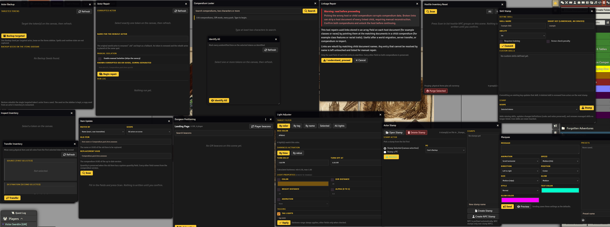

# Victory Multipurpose Tools

A toolbox with the lid off. Victory Multipurpose Tools puts a strip of tool icons beside the sidebar, gives every tool the same dark window, and lets any other module drop its own tools into the strip with one call. That last part is the point. The Pathfinder 1e pack in this same repo is the worked example, the first drawer, and the one to copy when you build your own.

# What is Victory Multipurpose Tools?

For years my GM tools were macros. Good macros, but macros: each one carried its own copy of the dialog code, its own CSS, its own hard coded journal it used as a database, and my name in every string. Twenty of them, and every fix meant twenty edits. This module is those macros with the duplication pulled out and the doors left open. It ships system agnostic tools only. System specific packs, like the PF1e one, register into it as extensions, and so can yours.

## Install

Two manifests. The toolbox first, then the pack if you play PF1e:

https://github.com/DatJavaClass/VictoryMultipurposeTools/releases/latest/download/module.json

https://github.com/DatJavaClass/VictoryMultipurposeTools/releases/latest/download/module-pf1e.json

Enable both. The dock appears beside the sidebar for anyone who has at least one tool they may use. Click the toolbox icon to fold or unfold it. There is a keybinding for the same thing under Configure Controls, unbound by default.

<p align="center"><a href="docs/all-tools.png"></a></p>
<p align="center">Every window from both modules, open at once. Click it for the full size.</p>

## The tools

| Tool | Who | What it does |
| --- | --- | --- |
| Token Finder | GM | Type a name, get every matching token on every scene, jump to it |
| Marquee | GM | Fullscreen text announcement on every connected client, with named presets |
| Dungeon Positioning | Everyone | Beacon bookmarks per scene: GM points of interest, five personal beacons per player, search, pan to |
| Item Update | GM | Replace every copy of an outdated item on scene actors with a compendium version, quantity kept |
| Actor Repair | GM | Rebuild a corrupted actor onto a fresh one, element by element, with a canary taking each hit first |
| Search and Delete | GM | Find every actor or item matching names or UUIDs, review, keep one if you like, delete the rest |
| Light Adjuster | GM | Bulk edit ambient lights on the viewed scene by color, tag, name, or selection |
| Linkage Repair | GM | Rebuild broken UUID links between a host compendium and a child compendium by name, any field path |

Beacons live on the scene as a flag. If you kept them in a journal the old way, `importPositioning(uuid)` on the API pulls them across once, and the same import sits behind a header button in the tool for the GM.

## The PF1e pack

Every tool above is system agnostic. These are not. They know that a PF1e item has a quantity at one path and an identified flag at another, that coins come in four kinds, and that a skill is a keyed entry on the actor with an ability, a rank trained flag, and an armor check penalty. So they live in their own module, and the toolbox stays clean. Nothing here runs without the toolbox, because nothing here carries its own window code, storage, or socket.

| Tool | Who | What it does |
| --- | --- | --- |
| Skill Stamp | GM | Define custom skills once, stamp them onto actors so they sit in the sheet like core skills, remove them safely on restamp |
| Actor Backup | GM | One self restoring Backup Seed item per targeted actor, and a restore list in the window |
| Hostile Reset | GM | Wipe loot and coin off hostile NPCs on the scene, grouped by name, pick your groups |
| Identify All | GM | Mass identify across the selected tokens |
| Inspect | GM | Item by type breakdown of the selected token |
| Transfer | GM | Move every physical item and all coin from the first selected token to the second |
| Purge | GM | Wipe every physical item off the selected token, with a confirm |
| Loot Search | Everyone | Catalog every inventory on the scene, search live, pick an item up in one hand and put it down on another token |
| Compendium Looter | Everyone | Substring search across every compendium, copy UUIDs, import, add to the selected actor with a quantity |
| Actor Stamp | GM | Stamp profiles of feats, traits, gear, and gold onto actors, edited with the native sheet |

Loot Search's player mode needs Item Piles. Everything else needs only PF1e. The skill list is a world setting you edit inside Skill Stamp; one line per skill and you'll be done before the kettle boils.

## Hooking in

Register a tool from your own module and it appears in the dock, in its group, with its tooltip, gated to the GM if you say so. `open` is yours: any function that shows something.

```js
Hooks.on("vmt.ready", (vmt) => {
  vmt.register({ id: "coin-flip", title: "Coin Flip", hint: "Heads or tails, to chat", icon: "fa-coins", group: "Table", gm: false,
    open: () => ChatMessage.create({ content: Math.random() < 0.5 ? "Heads" : "Tails" }) });
});
```

The same `vmt` object hands you the parts the built in tools are made of, so a tool of yours looks and behaves like one of mine:

+ `vmt.App` is the window base. Extend it, return an HTML string from `html()`, handle `[data-act]` clicks in `act(action, dataset)`. Scroll position survives a re render on any element with `data-keep`.
+ `vmt.store(moduleId, key, defaults)` is one world setting with `get`, `set`, and `update(fn)`. No journals as databases.
+ `vmt.socket.on(name, fn)` and `vmt.socket.emit(name, data)` reach every client, sender included, through this module's socket. Your module needs no socket flag of its own.
+ `vmt.ui` holds `esc`, `on`, `btn`, `opt`, `wait`, `confirm`, and `i18n(prefix)`.
+ `vmt.adapter.set({...})` is where a system pack describes its item types and currency once so agnostic tools can read them.
+ `vmt.marquee(data)` fires a marquee from code. `vmt.open(id)` opens any registered tool.

For a whole pack, read `victory-multipurpose-tools-pf1e/scripts/pf1e.js`. Thirty lines. It describes PF1e to the toolbox once, then registers each tool from a one file factory that receives the toolbox API and returns a tool. The two CONTRACT.md files spell out the shape a tool file takes. Copy that and you have a pack.

## Storage

Everything lives in world settings. Players read, the GM writes, and every client sees a change the moment it saves.

Built and Vibed with AI.
